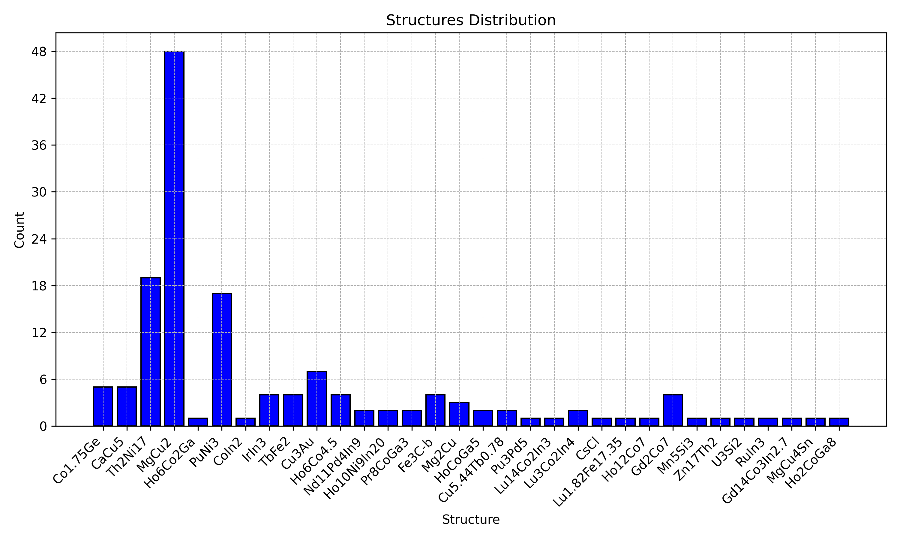

#######
|title|
#######

.. |title| replace:: cifkit documentation

|Python - Version| |PyPi version|

| Last updated |today|.

Installation
------------

.. code:: bash

   pip install cifkit

Citation
--------

If you use ``cifkit`` in your scientific publication, please cite the following:

- *cifkit: A Python package for coordination geometry and atomic site analysis*. `https://doi.org/10.21105/joss.07205 <https://doi.org/10.21105/joss.07205>`_

Statement of need
-----------------

``cifkit`` uses .cif files by offering higher-level functions and
variables that enable users to perform complex tasks efficiently with a
few lines of code. ``cifkit`` distinguishes itself from existing
libraries by offering higher-level functions and variables that allow
solid-state synthesists to obtain intuitive and measurable properties
impactful properties. It facilitates the visualization of coordination
geometry from each site using four coordination determination methods
and extracts physics-based features like volume and packing
efficiency—crucial for structural analysis in machine learning tasks.
Moreover, ``cifkit`` extracts atomic mixing information at the bond pair
level, tasks that would otherwise require extensive manual effort using
GUI-based tools like VESTA, Diamond, and CrystalMaker.

TL;DR
-----

``cifkit`` provides higher-level functions in just a few lines of code.

  -  **Coordination geometry** - ``cifkit`` provides functions for
     visualing coordination geometry from each site and extracts
     physics-based features like volume and packing efficiency in each
     polyhedron.
  -  **Atomic mixing** - ``cifkit`` extracts atomic mixing information at
     the bond pair level—tasks that would otherwise require extensive
     manual effort using GUI-based tools like VESTA, Diamond, and
     CrystalMaker.
  -  **Filter** - ``cifkit`` offers features for preprocessing. It
     systematically addresses common issues in CIF files from databases,
     such as incorrect loop values and missing fractional coordinates, by
     standardizing and filtering out ill-formatted files. It also
     preprocesses atomic site labels, transforming labels such as ‘M1’ to
     ‘Fe1’ in files with atomic mixing.
  -  **Sort** - ``cifkit`` allows you to copy, move, and sort ``.cif``
     files based on attributes such as coordination numbers, space groups,
     unit cells, shortest distances, elements, and more.

Processing speed expectation
----------------------------

Processing approximately 10,000 .cif files on a standard laptop (iMac
with M1 chip) may take about 30 to 60 minutes. At this rate, we can
process nearly all .cif files within 1–2 days.

Overview
--------

``cifkit`` provide two primary classes: ``Cif`` and ``CifEnsemble``.

Cif
~~~

``Cif`` is initialized with a ``.cif`` file path. It parses the ``.cif``
file, generates supercells, and computes nearest neighbors. It also
determines coordination numbers using four different methods and
generates polyhedrons for each site.

The example below uses ``cifkit`` to visualize the polyhedron generated
from each atomic site based on the coordination number geometry.

.. code:: python

   from cifkit import Cif

   cif = Cif("your_cif_file_path")
   site_labels = cif.site_labels

   # Loop through each site label
   for label in site_labels:
       # Dipslay each polyhedron, .png saved for each label
       cif.plot_polyhedron(label, is_displayed=True)

.. figure:: img/ErCoIn-polyhedron.png
   :alt: Polyhedron generation

   Polyhedron generation

CifEnsemble
~~~~~~~~~~~

``CifEnsemble`` is initialized with a folder path containing ``.cif``
files. It identifies unique attributes, such as space groups and
elements, across the ``.cif`` files, moves and copies files based on
these attributes. It generates histograms for all attributes.

The following example generates a distribution of structure.

.. code:: python

   from cifkit import CifEnsemble

   ensemble = CifEnsemble("your_cif_containing_folder_path")
   ensemble.generate_structure_histogram()

   structure distribution

Basde on your visual histogram above, you can copy and move .cif files
based on specific attributes:

.. code:: python

   # Return file paths matching structures either Co1.75Ge or CoIn2
   ensemble.filter_by_structures(["Co1.75Ge", "CoIn2"])

   # Return file path matching CeAl2Ga2
   ensemble.filter_by_structures("CeAl2Ga2")

Research software using ``cifkit``
----------------------------------

-  `CIF Bond Analyzer (CBA) <https://github.com/bobleesj/cif-bond-analyzer>`_
-  `Structure Analysis/Featurizer (SAF) <https://github.com/bobleesj/structure-analyzer-featurizer>`_
-  `CIF Cleaner <https://github.com/bobleesj/cif-cleaner>`_

How to ask for help
-------------------

``cifkit`` is also designed for experimental materials scientists and
chemists.

-  If you have any issues or questions, please feel free to reach out to
   Bob Lee `@bobleesj <https://github.com/bobleesj>`_ or `leave an
   issue <https://github.com/bobleesj/cifkit/issues>`_.

How to contribute to ``cifkit``
-------------------------------

Here is how you can contribute to the ``cifkit`` project if you found it helpful:

-  Star the repository on GitHub and recommend it to your colleagues who might find ``cifkit`` helpful as well. |Star GitHub repository|
-  Create a new issue for any bugs or feature requests `here <https://github.com/bobleesj/cifkit/issues>`_
-  Fork the repository and consider contributing changes via a pull request. |Fork GitHub repository|.
-  If you have any suggestions or need further clarification on how to use ``cifkit``, please reach out to Bob Lee (`@bobleesj <https://github.com/bobleesj>`_).

Contributors
------------

``cifkit`` has been greatly enhanced thanks to the contributions from a diverse group of researchers:

   -  **Anton Oliynyk**: co-author, original ideation with ``.cif`` files
   -  **Balaranjan Selvaratnam**: (`@balaranjan <https://github.com/balaranjan>`_): vectorization of distance calcuation to improve performance
   -  **Danila Shiryaev**: (`@dshirya <https://github.com/dshirya>`_): fix flat coordination number calculation and suggest separating computing connections and the coordination number to improve adoption

We also thank the following contributors for using ``cifkit`` and providing feedback:

   -  **Emil Jaffal**: (`@EmilJaffal <https://github.com/EmilJaffal>`_): initial testing and bug report
   -  **Nikhil Kumar Barua**: initial testing and bug report
   -  **Nishant Yadav**: (`@sethisiddha1998 <https://github.com/sethisiddha1998>`_): initial testing and bug report
   -  **Siddha Sankalpa Sethi**: (`@runzsh <https://github.com/runzsh>`_): initial testing and bug report
   -  **Fabian Zills**: (`@PythonFZ <https://github.com/PythonFZ>`_): suggested tooling improvements such as ``pre-commit``

We welcome all forms of contributions from the community. Your ideas and
improvements are valued and appreciated.

Other links
-----------

-  `MIT
   license <https://github.com/bobleesj/cifkit/blob/main/LICENSE>`_

.. |Python - Version| image:: https://img.shields.io/pypi/pyversions/cifkit
.. |PyPI version| image:: https://img.shields.io/pypi/v/cifkit.svg
   :target: https://pypi.python.org/pypi/cifkit
.. |Star GitHub repository| image:: https://img.shields.io/github/stars/bobleesj/cifkit.svg?style=social
   :target: https://github.com/bobleesj/cifkit/stargazers
.. |Fork GitHub repository| image:: https://img.shields.io/github/forks/bobleesj/cifkit?style=social
   :target: https://github.com/bobleesj/cifkit/fork

.. toctree::
   :maxdepth: 2
   :hidden:
   :caption: EXAMPLES

   notebooks/01_cif
   notebooks/02_cif_ensemble

.. toctree::
   :maxdepth: 2
   :hidden:
   :caption: REFERENCE

   Package API <api/cifkit>
   release
   license

Acknowledgements
----------------

``cifkit`` is built and maintained with `scikit-package <https://scikit-package.github.io/scikit-package/>`_.
