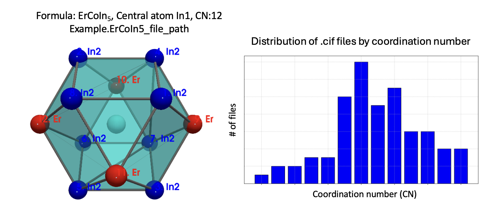

---
title:
  "cifkit: A Python package for coordination geometry and atomic site analysis"
tags:
  - Python
  - CIF
  - crystallography
  - materials science
  - solid state chemistry
  - crystal structure
  - machine learning

authors:
  - name: Sangjoon Lee
    orcid: 0000-0002-2367-3932
    corresponding: true
    affiliation: 1
  - name: Anton O. Oliynyk
    orcid: 0000-0003-0732-7340
    affiliation: "2, 3"
affiliations:
  - name:
      Department of Applied Physics and Applied Mathematics, Columbia
      University, New York, NY 10027, USA
    index: 1
  - name:
      Department of Chemistry, Hunter College, City University of New York, New
      York, NY 10065, USA
    index: 2
  - name:
      Ph.D. Program in Chemistry, The Graduate Center of the City University of
      New York, New York, NY 10016, USA
    index: 3
date: 29 August 2024
bibliography: paper.bib
---

# Summary

`cifkit` provides higher-level functions and properties for coordination
geometry and atomic site analysis from .cif files, which are standard file
formats for storing crystallographic data such as atomic fractional coordinates,
symmetry operations, and unit cell dimensions. Designed for functionalities
demanded by experimental synthesists, cifkit has been used as a backend for
Python applications that automate crystal structure analysis, enabling the
extraction of physics-based features crucial for understanding geometric
configurations and identifying irregularities. `cifkit` offers functions such as
plotting coordination geometry-based polyhedron from each site, calculating bond
fractions, determining atomic mixing information, and sorting .cif files based
on a set of attributes.

# Statement of need

In solid state chemistry and materials science, the Crystallographic Information
File (CIF) [@hall_crystallographic_1991] is the primary file format for storing
and distributing crystal structure information. Open-source Python packages for
reading, editing, and creating CIF files include Python Materials Genomics
(pymatgen) [@ong_python_2013] and the Atomic Simulation Environment (ASE)
[@larsen_atomic_2017]. Pymatgen offers advanced functionalities such as
generating electronic structure properties, phase diagrams, and implementing
coordination environment identification through ChemEnv
[@waroquiers_chemenv_2020]. ASE provides a comprehensive suite of tools for
generating and running atomistic simulations.

`cifkit` distinguishes itself from existing libraries by offering higher-level
functions and variables that allow solid-state synthesists to obtain intuitive
and measurable properties of interest. It facilitates the visualization
of coordination geometry from each site using four coordination determination
methods and extracts physics-based features like volume and packing efficiency,
which are crucial for structural analysis in machine learning tasks. Moreover,
`cifkit` extracts atomic mixing information at the bond pair level, tasks that
would otherwise require extensive manual effort using GUI-based tools like
VESTA, Diamond, and CrystalMaker. These functions can be further developed
on-demand, as demonstrated by `cifkit`'s ability to extract coordination
geometry information based on four coordination number determination methods for
a newly discovered phase [@tyvanchuk_crystal_2024].

`cifkit` further enhances its utility by providing functions for sorting,
preprocessing, and analyzing the distribution of underlying CIF files. It
systematically addresses common issues in CIF files from databases, such as
incorrect loop values and missing fractional coordinates, by standardizing and
filtering out ill-formatted files. The package also preprocesses atomic site
labels, transforming labels such as 'M1' into 'Fe1' in files with atomic mixing for
enhanced visualization and pattern matching. Beyond error correction, `cifkit`
offers functionalities to copy, move, and sort files based on attributes such as
coordination numbers, space groups, unit cells, and shortest distances. It
excels in visualizing and cataloging CIF files, organizing them by supercell
size, tags, coordination numbers, elements, and atomic mixing.

# Examples

`cifkit` is designed to minimize reliance on API documentation for users with
limited programming experience and no background in computational materials
science or chemistry. By simplifying user interactions while maintaining robust
functionality, `cifkit` enables a broader range of scientists to leverage
computational tools for complex tasks—such as extracting geometry-based
polyhedra descriptors from atomic sites. The full installation process can be
executed via a Jupyter notebook, accessible through the Google Colab URL
provided in the official documentation.



```python
from cifkit import Cif, Example

# Initialize with the .cif file path
>>> cif = Cif(Example.Er10Co9In20_file_path)

# Plot polyhedron from the site element of In1
>>> cif.plot_polyhedron("In1")

# Atomic mixing information
>>> cif.site_mixing_type  # full occupancy, full_occupancy_atomic_mixing, etc.

# Determine coordination numbers based on four methods:
>>> cif.CN_max_gap_per_site
{
    "In1": {
        "dist_by_shortest_dist": {"max_gap": 0.306, "CN": 14},
        "dist_by_CIF_radius_sum": {"max_gap": 0.39, "CN": 14},
        "dist_by_CIF_radius_refined_sum": {"max_gap": 0.341, "CN": 12},
        "dist_by_Pauling_radius_sum": {"max_gap": 0.398, "CN": 14},
    },
    ...
    "Rh2": {
        "dist_by_shortest_dist": {"max_gap": 0.31, "CN": 9},
        "dist_by_CIF_radius_sum": {"max_gap": 0.324, "CN": 9},
        "dist_by_CIF_radius_refined_sum": {"max_gap": 0.397, "CN": 9},
        "dist_by_Pauling_radius_sum": {"max_gap": 0.380, "CN": 9},
    },
}
```

For processing a large number of .cif files, you may use `CifEnsemble`:

```python
from cifkit import CifEnsemble, Example

# Initialize with the folder path containing .cif files
>>> ensemble = CifEnsemble(Example.ErCoIn_big_folder_path)

# Filter .cif by formula(s)
>>> ensemble.filter_by_formulas(["LaRu2Ge2"])

# Filter .cif by site mixing type(s)
>>> ensemble.filter_by_site_mixing_types(["deficiency_without_atomic_mixing"])

# Filter .cif by coordination number(s)
>>> ensemble.filter_by_CN_min_dist_method_containing([14])
```

# Applications

`cifkit` has been used for research conducted at academic and national
laboratories for crystal structure analysis and machine learning studies. CIF
Bond Analyzer (CBA) utilizes `cifkit` to extract coordination geometry
information for a newly discovered phase [@tyvanchuk_crystal_2024]. The
Structure Analysis/Featurizer (SAF) employs `cifkit` to construct and extract
physics-based geometric features for binary and ternary compounds
[@jaffal_composition_2024]. Furthermore, geometric features generated with
`cifkit` are being incorporated into a follow-up study on thermoelectric
materials [@barua_interpretable_2024], building upon the compositional
properties explored in [@lee_machine_2024].

# Acknowledgement

We acknowledge the initial testing done by Nishant Yadav, Siddha Sankalpa Sethi,
and Arnab Dutta from the Indian Institute of Technology, Kharagpur. We also
thank Emil Jaffal, Danila Shiryaev, and Alex Vtorov from CUNY Hunter College for
their testing efforts. We acknowledge Fabian Zills for his recommendations on
Python tooling.

We thank the developers of the following dependencies:

- gemmi [@wojdyr_gemmi_2022]: .cif parsing and space group operations
- matplotlib [@hunter_matplotlib_2007]: visualization of histograms
- numpy [@harris_array_2020]: angle conversion, linear algebra
- pyvista [@sullivan_pyvista_2019]: visualization of polyhedra
- scipy [@virtanen_scipy_2020]: minimization function to refine of CIF radius

# References
